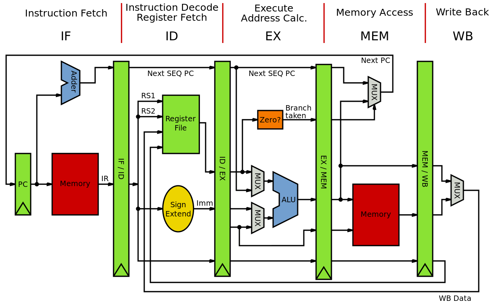

# PipelinedMIPS
In this project, a 16-bit pipelined MIPS processor is implemented in Verilog HDL.
## Implementation
### Stages

MIPS pipeline has  five stages, with one step per stage:

• IF: Instruction fetch from memory.

• ID: Instruction decode & register read.

• EX: Execute operation or calculate address.

• MEM: Access memory operand.

• WB: Write result back to register.

Each stage takes in data from that buffer, processes it and write into the next buffer. Also note that as an instruction moves down the pipeline from one buffer to the next, its relevant information also moves along with it.

### Instructions

1. Add : R[rd] = R[rs] + R[rt]
2. Subtract : R[rd] = R[rs] - R[rt]
3. And: R[rd] = R[rs] & R[rt]
4. Or : R[rd] = R[rs] | R[rt]
5. SLT: R[rd] = 1 if R[rs] < R[rt] else 0
6. SLTI: R[rt] = 1 if R[rs] < SignExtImm else 0
7. Lw: R[rt] = M[R[rs]+SignExtImm]
8. Sw : M[R[rs]+SignExtImm] = R[rt]
9. Beq : if(R[rs]==R[rt]) PC=PC+1+BranchAddr
10. J : PC=JumpAddr

## observations

* With pipelining, multiple instructions are overlapped during execution.
* Latency is the same, but throughput  improves.
* Pipeline rate limited by slowest pipeline stage.
* Potential speedup = Number of pipe stages.

## Dependencies
### macOS
This project needs [Icarus-Verilog](http://iverilog.icarus.com) and a VCD viewer.

## Building on macOS
1. Icarus-Verilog can be installed via Homebrew :
   <code>$ brew install icarus-verilog</code>
2. Download [Scansion](http://www.logicpoet.com/scansion/) from here.  
3. Clone the repository.
4. Run <code>$ make </code> and type MIPS code to see it in binary form in rams_init_file.hex file. 

5. <code>$ make simulate</code> will: 
* compile design+TB
* simulate the verilog design

6. <code>$ make display</code> will: 
*  display waveforms.
---
 📌📌📌  You should use a for loop to dump array words in your test bench.
Check out these articles! 
1. [Verilog Portability Notes](https://iverilog.fandom.com/wiki/Verilog_Portability_Notes)
2. [Icarus verilog dump memory array](https://stackoverflow.com/questions/20317820/icarus-verilog-dump-memory-array-dumpvars)

### Data Path

